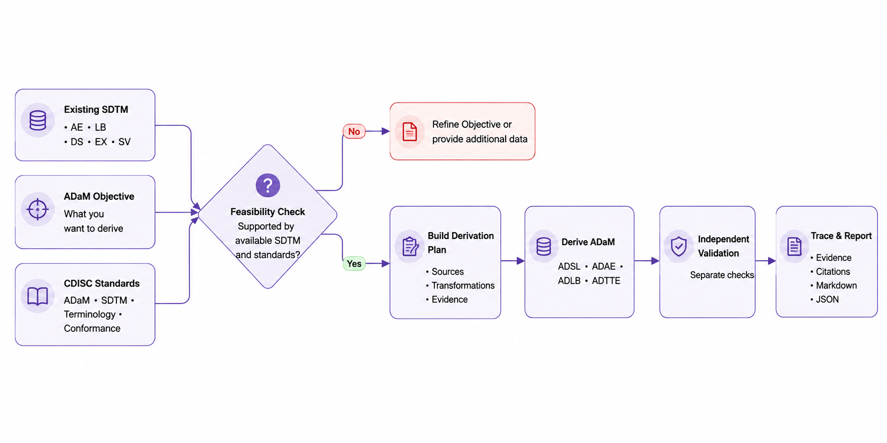

# CDISC Standards-Driven SDTM-to-ADaM

Reusable Skill for answering concrete clinical or analysis objectives from existing SDTM by checking CDISC feasibility, deriving supported ADaM outputs, validating independently, and returning traceable evidence.

This repository packages **CDISC SDTM to ADaM** as one canonical Skill with Codex and Claude Code adapters.

- Canonical Skill: [SKILL.md](SKILL.md)
- Codex adapter: [skills/cdisc-sdtm-to-adam/](skills/cdisc-sdtm-to-adam/)
- Claude Code adapter: [.claude/skills/cdisc-sdtm-to-adam/](.claude/skills/cdisc-sdtm-to-adam/)

## Workflow



| Stage | What it means |
|---|---|
| Feasibility Check | Confirm the requested clinical or analysis objective can be supported by available SDTM and standards. |
| Build Derivation Plan | Define source variables, derivation rules, transformations, and supporting evidence before execution. |
| Independent Validation | Validate the derived result separately from derivation. |
| Trace & Report | Link decisions back to evidence and produce the final report. |

## What The Skill Does

Provide existing SDTM datasets and a concrete clinical or analysis objective. The Skill checks feasibility first, maps the objective to supported ADaM outputs when possible, builds an explicit derivation plan, derives the outputs after confirmation, validates them independently, and returns traceability with deterministic reports.

An objective is the question the user wants to answer, not the dataset name to produce.

| Good objective | Avoid as the user objective |
|---|---|
| When and why do subjects discontinue the trial? | Create ADSL. |
| Which subjects experienced treatment-emergent adverse events, and how severe were they? | Derive ADAE. |
| How do key lab values change from baseline over scheduled visits? | Run the pipeline. |

## Supported Scope

| Existing SDTM input | Supported ADaM output |
|---|---|
| `DM` | `ADSL` |
| `AE` | `ADAE` |
| `LB` | `ADLB` |
| `DS`, `EX`, `SV` | `ADTTE` |

Existing SDTM is required. Raw -> SDTM mapping, SDTM conformance transformation, statistical analysis, machine learning, dashboards, AI summaries, Define-XML generation, and regulatory certification are outside Version 1 scope.

## Workflow / Pipeline

The implemented Version 1 flow is:

```text
Standards Discovery
  -> Rule Extraction
  -> Feasibility Assessment
  -> Preprocessing Specification
  -> Preprocessing
  -> ADaM Specification
  -> ADaM Derivation
  -> Independent Validation
  -> Evidence Resolution
  -> Reporting
```

Specification is required before implementation. Unsupported objectives should be refined or supplied with missing data before derivation.

## Quick Start

After installation, invoke one of the CDISC modes below.

### CDISC Feasibility Checker

Use this mode to decide whether an objective is supportable before deriving anything.

```text
Use CDISC Feasibility Checker.

Objective: When and why do subjects discontinue the trial?
Available SDTM: DM, DS, SV, AE, EX, LB.

Check whether this objective is feasible with the available SDTM data. Identify required domains, missing variables, assumptions, and the ADaM outputs needed.
```

### CDISC SDTM to ADaM Transfer

Use this mode only after the objective and derivation plan are confirmed.

```text
Use CDISC SDTM to ADaM Transfer.

Objective: When and why do subjects discontinue the trial?

Use the confirmed feasibility result and derivation plan to derive the supported ADaM outputs, validate them independently, and generate the traceability report.
```

### CDISC SDTM to ADaM

Use this mode for the complete guided workflow: feasibility first, then confirmation, then transfer.

```text
Use CDISC SDTM to ADaM.

Objective: How do key lab values change from baseline over scheduled visits?
Available SDTM: DM, LB, SV, EX.

First check feasibility, then show the derivation plan. Wait for confirmation before running the transfer.
```

### Codex

The Codex Skill is displayed as **CDISC SDTM to ADaM**.

```text
Use CDISC SDTM to ADaM.

Objective: Which subjects experienced treatment-emergent adverse events, and how severe were they?
Available SDTM: DM, AE, EX.

First check feasibility, then show the derivation plan before transfer.
```

### Claude Code

Invoke the Claude Code adapter with:

```text
/cdisc-sdtm-to-adam
```

Then provide the same SDTM datasets and clinical or analysis objective.

## Outputs

| Output | Description |
|---|---|
| ADaM datasets | Supported `ADSL`, `ADAE`, `ADLB`, and `ADTTE` outputs. |
| Specifications | Explicit preprocessing and derivation plans generated before implementation. |
| Validation results | Independent checks of structure, logic, and traceability. |
| Evidence and citations | Links from decisions and derivations back to available standards evidence. |
| Reports | Deterministic Markdown and JSON summaries. |

## Standards / Evidence Model

Licensed CDISC source documents are not bundled in GitHub. Runtime discovery uses configured standards manifests and locally available authorized source files. If a required local file is missing, the runtime records that standard as unavailable rather than inventing evidence.

| Group | Sources | Purpose |
|---|---|---|
| Primary ADaM | ADaM Model, ADaM Implementation Guide, OCCDS Implementation Guide, BDS Time-to-Event Guide, Important Considerations, Metadata Submission Guidelines, Controlled Terminology, Conformance Rules | ADaM derivation rules, terminology, validation, and conformance evidence. |
| Upstream SDTM | SDTM Model, SDTM Implementation Guide | Interpretation of existing SDTM structure and variable semantics. |
| Validation references | ADaM Examples, ADaM MSG Example Submission, ADaM Traceability Examples | Regression support, structural comparison, implementation comparison, and validation support. |

Runtime users do not perform standards intake, choose standards versions, select filenames, calculate checksums, or verify document identity. Those are maintainer responsibilities.

## Architecture

The Python implementation behind the Skill lives in `src/standards_driven_sdtm_adam/`. See [Architecture Overview](docs/architecture/overview.md) for module boundaries and runtime flow.

## Documentation

Start with the [documentation index](docs/README.md).

| Topic | Link |
|---|---|
| Architecture | [docs/architecture/overview.md](docs/architecture/overview.md) |
| Standards setup | [docs/standards/standards-registry.md](docs/standards/standards-registry.md) |
| Usage examples | [docs/guides/usage-examples.md](docs/guides/usage-examples.md) |
| Evidence resolution | [docs/pipeline/evidence-resolution.md](docs/pipeline/evidence-resolution.md) |
| Reporting | [docs/pipeline/reporting.md](docs/pipeline/reporting.md) |
| Release history | [docs/release/v1.0.0.md](docs/release/v1.0.0.md) and [CHANGELOG](CHANGELOG.md) |

## Development

Developers can install the Python package locally to run or test the Version 1 pipeline:

```powershell
python -m pip install -e .
```

```python
from standards_driven_sdtm_adam.pipeline import V1Pipeline

pipeline = V1Pipeline()
result = pipeline.run(
    registry_dir="config/standards",
    task_intents=(...),
    research_objectives=(...),
    sdtm_datasets={...},
)

print(result.markdown_report)
```

See [Usage Examples](docs/guides/usage-examples.md) for a complete runnable example.

## License

See [LICENSE](LICENSE).
