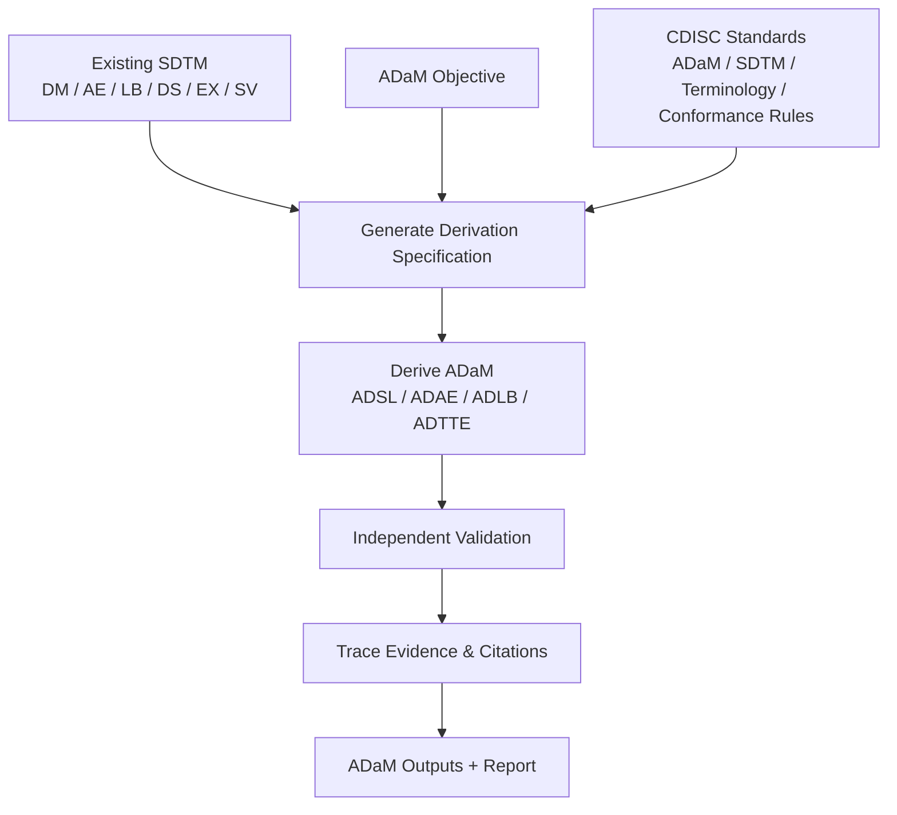

# CDISC Standards-Driven SDTM-to-ADaM

Reusable Codex Skill for deriving supported ADaM datasets from existing SDTM using CDISC standards, explicit specifications, independent validation, and traceable evidence.

This repository packages **CDISC SDTM to ADaM**, a CDISC Standards-Driven SDTM-to-ADaM Codex Skill. It is designed for teams that already have SDTM datasets and need governed, evidence-backed derivation of supported ADaM outputs.

## Use In Codex

The Skill is displayed to users as **CDISC SDTM to ADaM**.

Use it in Codex with a plain-language request:

```text
Use the "CDISC SDTM to ADaM" skill to derive ADSL from these SDTM datasets.
```

The package identifier remains `standards-driven-sdtm-adam` for filesystem and installation compatibility. The user-facing name comes from `skills/standards-driven-sdtm-adam/agents/openai.yaml`.

## Workflow



## At A Glance

| Question | Answer |
|---|---|
| What do I provide? | Existing SDTM datasets and the ADaM objective. |
| What does the Skill do? | Uses configured CDISC standards to specify, derive, validate, trace, and report supported ADaM outputs. |
| What needs my interaction? | Study-specific decisions when required, and CDISC access only when protected standards are missing locally. |
| What is reused later? | Configured standards manifests, cached local source files, specifications, evidence, and reports. |

## Supported Scope

| Existing SDTM input | Supported ADaM output |
|---|---|
| `DM` | `ADSL` |
| `AE` | `ADAE` |
| `LB` | `ADLB` |
| `DS`, `EX`, `SV` | `ADTTE` |

Existing SDTM is required. Raw -> SDTM mapping, SDTM conformance transformation, statistical analysis, machine learning, dashboards, AI summaries, Define-XML generation, and regulatory certification are outside Version 1 scope.

## Standards

Licensed CDISC source documents are not bundled in GitHub. Runtime discovery uses configured standards manifests and locally available authorized source files. If a required local file is missing, the runtime records that standard as unavailable rather than inventing evidence.

| Group | Sources | Purpose |
|---|---|---|
| Primary ADaM | ADaM Model, ADaM Implementation Guide, OCCDS Implementation Guide, BDS Time-to-Event Guide, Important Considerations, Metadata Submission Guidelines, Controlled Terminology, Conformance Rules | ADaM derivation rules, terminology, validation, and conformance evidence. |
| Upstream SDTM | SDTM Model, SDTM Implementation Guide | Interpretation of existing SDTM structure and variable semantics. |
| Validation references | ADaM Examples, ADaM MSG Example Submission, ADaM Traceability Examples | Regression support, structural comparison, implementation comparison, and validation support. |

Normal Skill use does not require users to perform standards intake, choose standards versions, select filenames, calculate checksums, or verify document identity. Those are maintainer responsibilities.

## What You Get

| Output | Description |
|---|---|
| ADaM datasets | Supported `ADSL`, `ADAE`, `ADLB`, and `ADTTE` outputs. |
| Specifications | Explicit preprocessing and derivation plans generated before implementation. |
| Validation results | Independent checks of structure, logic, and traceability. |
| Evidence and citations | Links from decisions and derivations back to available standards evidence. |
| Reports | Deterministic Markdown and JSON summaries. |

## Developer Interface

The Python package is the implementation behind the Codex Skill. Developers can install it locally to run or test the Version 1 pipeline:

```powershell
python -m pip install -e .
```

```python
from standards_driven_sdtm_adam.pipeline import V1Pipeline

pipeline = V1Pipeline()
result = pipeline.run(
    registry_dir="config/standards",
    task_intents=(...),
    research_objectives=(...),
    sdtm_datasets={...},
)

print(result.markdown_report)
```

See [Usage Examples](docs/usage-examples.md) for a complete runnable example.

## Documentation

| Topic | Link |
|---|---|
| Architecture | [docs/architecture.md](docs/architecture.md) |
| Standards setup | [docs/standards-registry.md](docs/standards-registry.md) |
| Usage examples | [docs/usage-examples.md](docs/usage-examples.md) |
| Evidence resolution | [docs/evidence-resolution.md](docs/evidence-resolution.md) |
| Reporting | [docs/reporting.md](docs/reporting.md) |

Release history: [Release Notes](docs/release-notes-v1.0.0.md) and [CHANGELOG](CHANGELOG.md).
