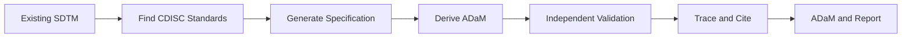
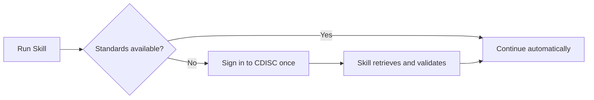

# Standards-Driven SDTM-to-ADaM Pipeline

Turn existing SDTM datasets into supported ADaM outputs using CDISC standards, explicit derivation specifications, independent validation, and traceable evidence. Provide your SDTM data and ADaM objective; the Skill handles standards discovery, derivation planning, execution, validation, and reporting.



## At a Glance

| Question | Answer |
|---|---|
| What do I provide? | Existing SDTM datasets and an ADaM objective. |
| What does the Skill do? | Finds standards, creates a specification, derives ADaM, validates independently, and reports traceability. |
| What needs my interaction? | CDISC sign-in only when protected standards are missing locally. |
| What is reused later? | Cached standards and prepared reference assets. |

## Inputs & Outputs

| Existing SDTM input | Supported ADaM output |
|---|---|
| DM | ADSL |
| AE | ADAE |
| LB | ADLB |
| DS / EX / SV | ADTTE |

Existing SDTM is required; Raw-to-SDTM mapping and SDTM conformance transformation are not part of this Skill.

## Standards

Licensed CDISC source documents are not bundled in GitHub. The Skill determines required sources, reuses cached copies, and uses normal CDISC/cdiscID authentication only when protected sources are missing.

After you sign in once, the same authenticated browser session locates, retrieves, validates, and stores required standards and reference assets for reuse.



| Group | Sources | Purpose |
|---|---|---|
| Primary ADaM | ADaM Model, ADaMIG, OCCDS IG, BDS TTE, Important Considerations, Metadata Submission Guidelines, Controlled Terminology, Conformance Rules | ADaM derivation rules, terminology, validation |
| Upstream SDTM | SDTM Model, SDTMIG | Interpret existing SDTM structure and variable semantics |
| Validation references | ADaM Examples, ADaM MSG Example Submission, ADaM Traceability Examples | Regression, structural comparison, validation and traceability support |

No API key is required in the normal user flow.

## What You Get

| Output | Description |
|---|---|
| ADaM datasets | Supported `ADSL`, `ADAE`, `ADLB`, and `ADTTE` outputs. |
| Specifications | Explicit preprocessing and derivation plans generated before implementation. |
| Validation results | Independent checks of structure, logic, and traceability. |
| Evidence and citations | Links from specifications and decisions back to standards evidence. |
| Reports | Deterministic Markdown and JSON summaries. |

## Quick Start

```powershell
python -m pip install -e .
```

```python
from standards_driven_sdtm_adam.pipeline import V1Pipeline

pipeline = V1Pipeline()
result = pipeline.run(
    registry_dir="config/standards",
    task_intents=(...),
    research_objectives=(...),
    sdtm_datasets={...},
)

print(result.markdown_report)
```

See [Usage Examples](docs/usage-examples.md) for a complete runnable example.

## Documentation

| Topic | Link |
|---|---|
| Architecture | [docs/architecture.md](docs/architecture.md) |
| Standards setup | [docs/standards-registry.md](docs/standards-registry.md) |
| Usage examples | [docs/usage-examples.md](docs/usage-examples.md) |
| Evidence resolution | [docs/evidence-resolution.md](docs/evidence-resolution.md) |
| Reporting | [docs/reporting.md](docs/reporting.md) |

Release history: [Release Notes](docs/release-notes-v1.0.0.md) and [CHANGELOG](CHANGELOG.md).
